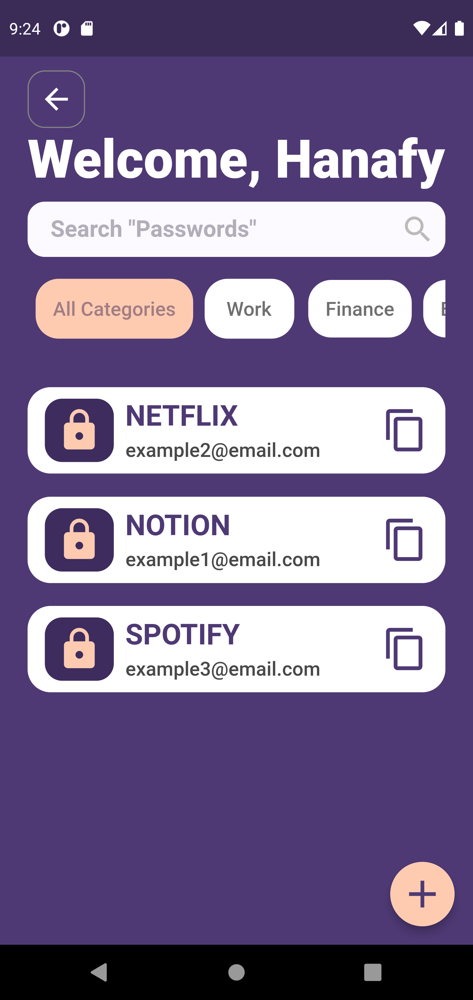
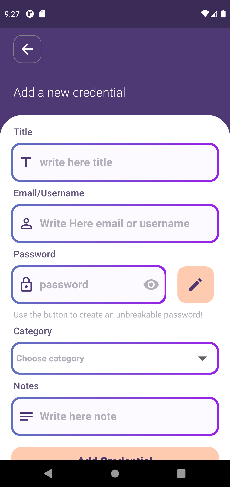
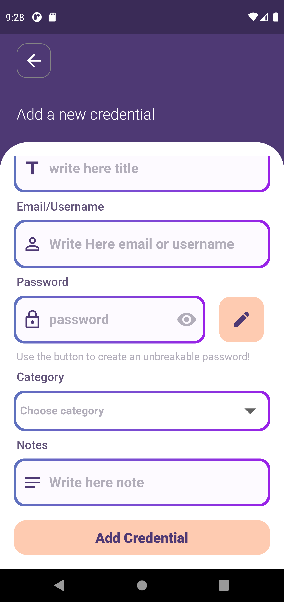
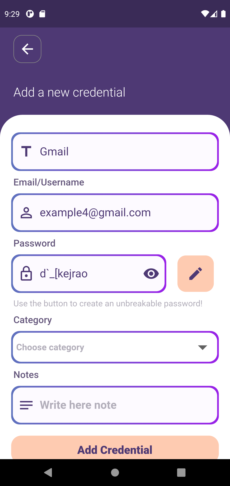
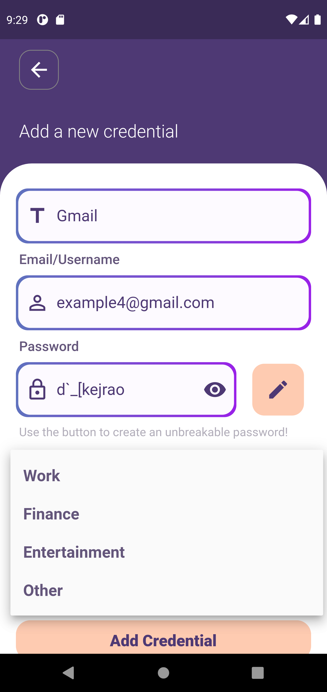
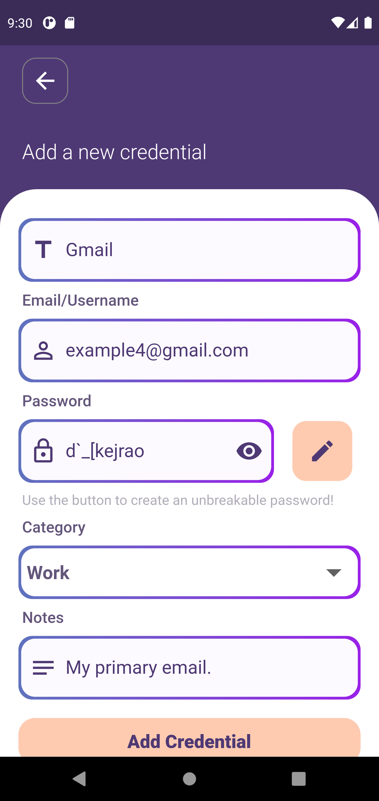
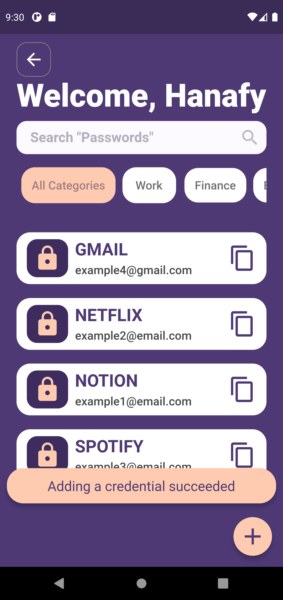
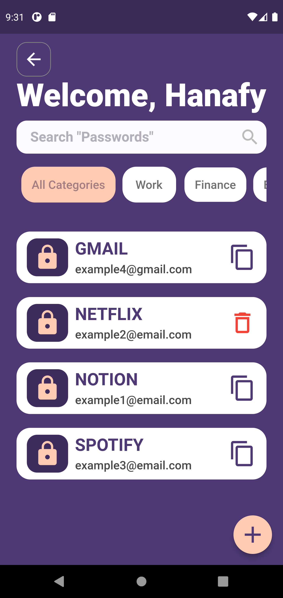
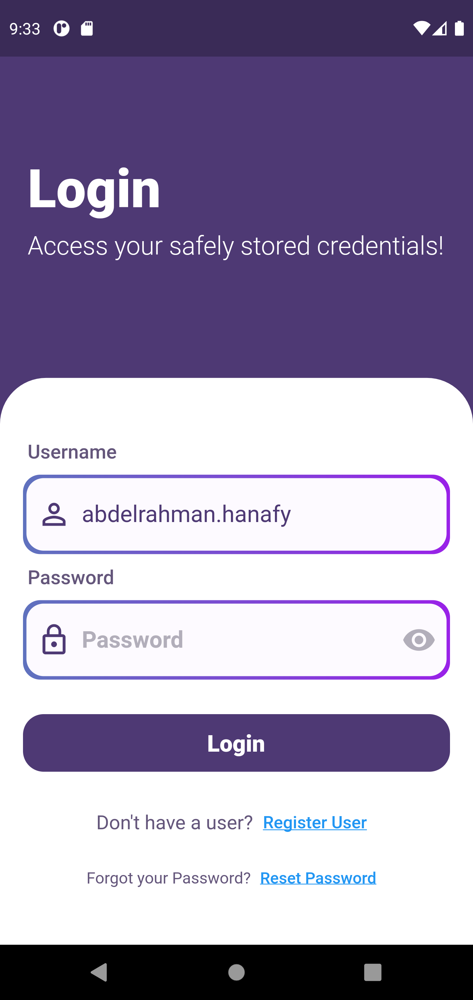
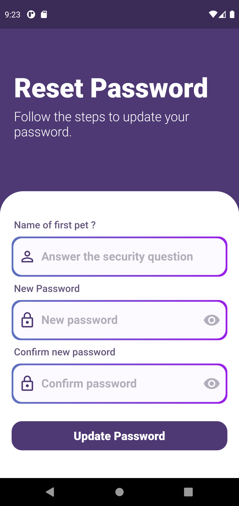

# Password Rolodex

## APP Preview

## Project Description

Every website or service out there require you to create an account using email/username and password. So, when you decide to use a website you haven't used in a long time you forget your credentials (or at least I do :)). One solution to this problem is to unify the credentials in all websites and services, but we all know that this is a bad idea and do not often end well. 

I decided to build a simple application to allow me to use unique and complex credentials without worrying about forgeting them (or as we will see later, without even having to know them!! ) when I need them later.

## Key Features
1. User registeration.
2. User login.
3. Reset application password.
4. Adding/Deleting credentials.
5. Generating complex password for a new credential.
6. Searching for credentials using name/category.
7. Copying a password to the clipboard.

## Technologies Used
- Flutter: to build the UI.
- Provider Package: to manange the state of the application.
- sqflite Package: to setup and use a local database to store user information and credentials.
 
## Future Features to be added
- The ability to edit a credential.
- Encrypting/Decrypting user credentials as a layer of security.
- The ability to backup credentials to the cloud so data can be easily transfered if user decided to change phones.

## Walkthrough
- The user enter the login screen when he/she starts the application.

- The user can create a new account using the __Register User__ button to take him to the registeration screen.

- The user then enter the Home Page, let's assume that the user added three credentials (will show how later).

- The user can search for a specific credential using the search box.

- The user can also search for credentials based on categories.

- Pressing the add button on the bottom right corner will take the user to the screen were the user can fill the data needed to add a new credential.

- The user can choose between filling the password field or pressing the button to generate a complex password.

> The user doesn't need to know the password as it can be easily copied and pasted wherever needed.

- The user can then specify the category of the credential using the drop down menu. 

- Pressing the __Add Credential__ button will add the credential to the database for later retrievals.

- The user can copy the password of a specific credential by tapping the copy icon of that credential

- A long press on a specific credential will show the option to delete it and tapping the delete icon will delete that credential.

- The user can logout by tapping the back button in the upper left corner of the home page. The user will be returned to the login page.

- The user can type his password any time he/she wants to or in case the user forget his password, he/she can press the __Reset Password__ button to change the password of the user account.

> __NOTE:__ The user must enter his/her username first before pressing the __Reset Password__ button fot the feature to properly work. 

If you reached this point, you are great, thank you :)

With that we reached the end of this long guide.

If you have any ideas, I would love to hear them.

Good Bye 👋 👋 .